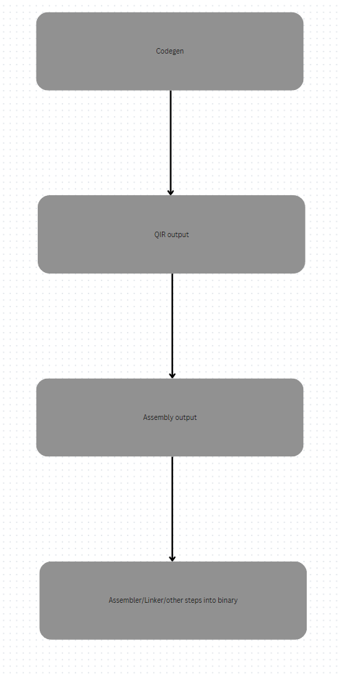

# QIR - a simpler alternative to LLVM
  
I plan to do AOT compilation for my language,but I have one major problem... llvm **SUCKS**
  
Theres many reasons as to why llvm isnt the greatest for developers but heres my main gripe  

it's extremely complicated just take a look at the llvm api graph   

Like what the actual fuck is that I plan to make something you can transpile to, and it converts it to the native assembly so instead of the above photo its more like this:
  
Super simple look at it! but yeah I know its going to have to grow past this level of simplicity 

heres the syntax I've been thinking about, a kind of high level assembly  

So to create a function
```
en main rsi rdi:
    move $1 -> rax
    move $2 -> $1
    call foobar
foobar rax rsi:
    ...
```
or a new thread:
```
// threads cannot access memory outside of their own scope,under the hood this would redefine the values
nt woahasync:
    kasdofjhaosifughqwueh
```
variables:
```
val skull
mov rax -> @skull
```
@ being an opereator for the memory address of  
structs:
```
ds test:
    [byte] teststr
    4b teststrlen
    4b scount // for every struct there is a struct counter just to keep track of how many instances of this struct has been created
```

-- Wij - 10/7